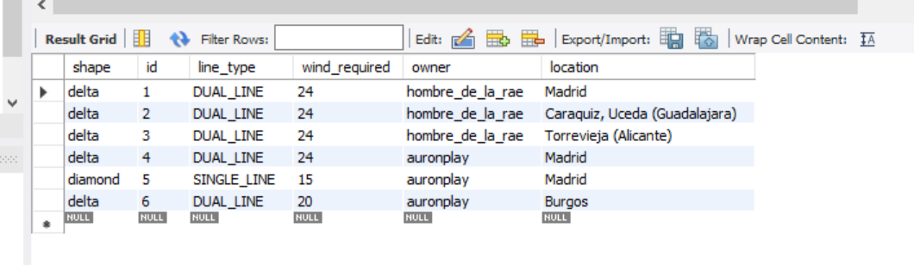
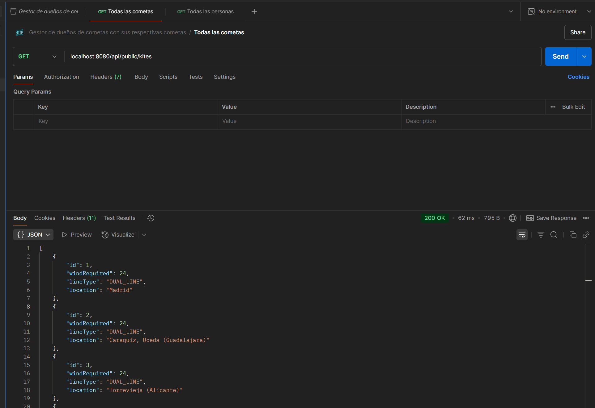
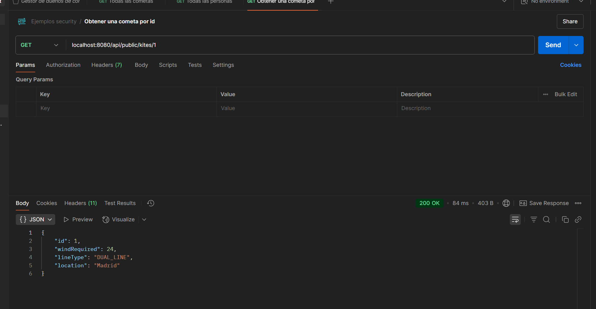

# Descripción del proyecto

## Este proyecto consiste en la gestión de una base de datos que consta de cometas y personas.

### Mi tablero de Trello https://trello.com/b/YTSiRLbZ/kite-project

1. Aquí tengo definido el UML y sus relaciones correspondientes 

```
@startuml
abstract class Kite{
- id: int
- windLimit: int
- shape: KiteShape
- line: LineType
- location: String
- owner: Person
  }

class StuntKite extends Kite {

}

class StaticKite extends Kite {
}

class TractionKite extends Kite {
}

class Person {
- userName: String
- password: String
- kites: Kite[]
- roles: Role[]
  }

enum KiteShape {
DELTA, DIAMOND, PARAFOIL
}

enum LineType {
SINGLE_LINE, DUAL_LINE
}

enum ERole {
ADMIN, USER
}

class Role {
- id: int
- rol: ERole
}

Kite "*" o-- "1" Person

Role "*" o-- "*" Person
@enduml
```


2. Así es como he creado el proyecto, con estás dependencias


3. Una vez levantado el servidor, me crea las tablas automáticamente, ya que en el fichero properties, tengo configurado esta opción

```spring.jpa.hibernate.ddl-auto=update```

Estás son las tablas resultantes, cuyas relaciones son estas, como se puede observar, el shape de la tabla kites es una columna
determinante, también llamada como discriminator value, ya que esta va a determinar el tipo de cometa que tiene la persona:


Como se puede observar en las imágenes, en la tabla kite, hay una columna especial llamada shape, ya que en Java, al haber una clase
madre (Kite) y varias clases hijas, que hacen referencia a los distintos tipos de cometas. Como aplicamos herencia, he escogido la estrategia
de una unica tabla con una columna discriminatoria.

4. Para que funcione la autenticación, he añadido esta dependencia en el fichero pom.xml

```
<dependency>
	<groupId>com.auth0</groupId>
	<artifactId>java-jwt</artifactId>
	<version>3.18.1</version>
</dependency>
```

5. Demos con postman

Actualmente, tras realizar varios test, tengo registros en las tablas persons y kites.

Por un lado, en las tablas person tenemos esto:


Por otro lado, en las tablas kites tenemos esto:



Al mostrar las personas, nos lo muestra con sus cometas


Por otro lado, al mostrar todas las cometas, simplemente muestro las cometas que hay en la base de datos.
Ya que de mostrar también a sus dueños, entrariamos en una redundancia ciclica y la salida se haría ilegible.



Al obtener una cometa por id, me sale este resultado




