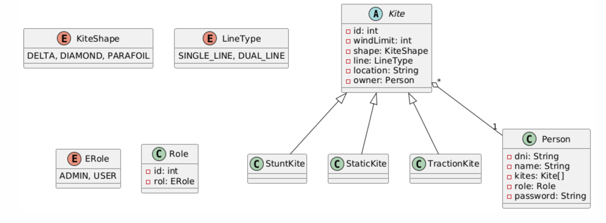
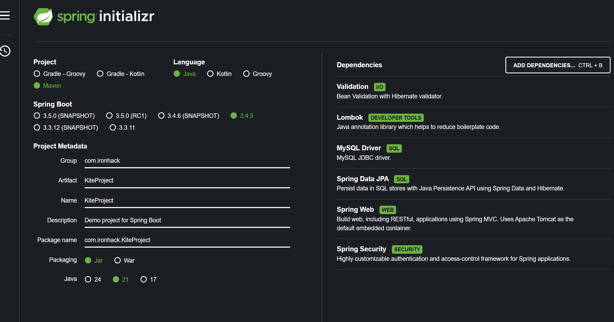
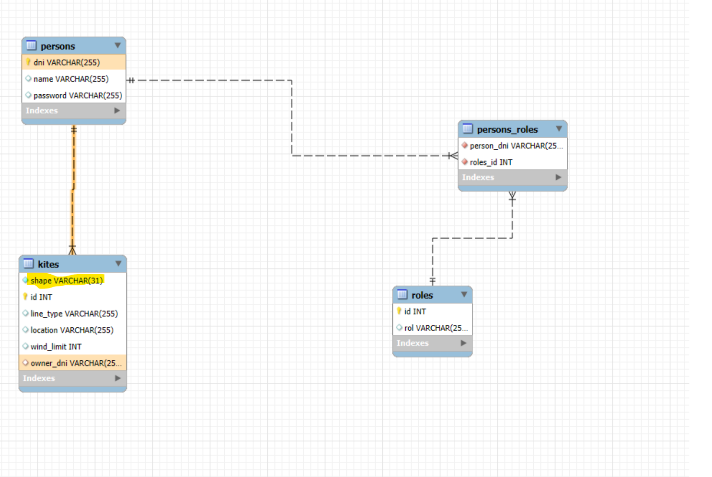
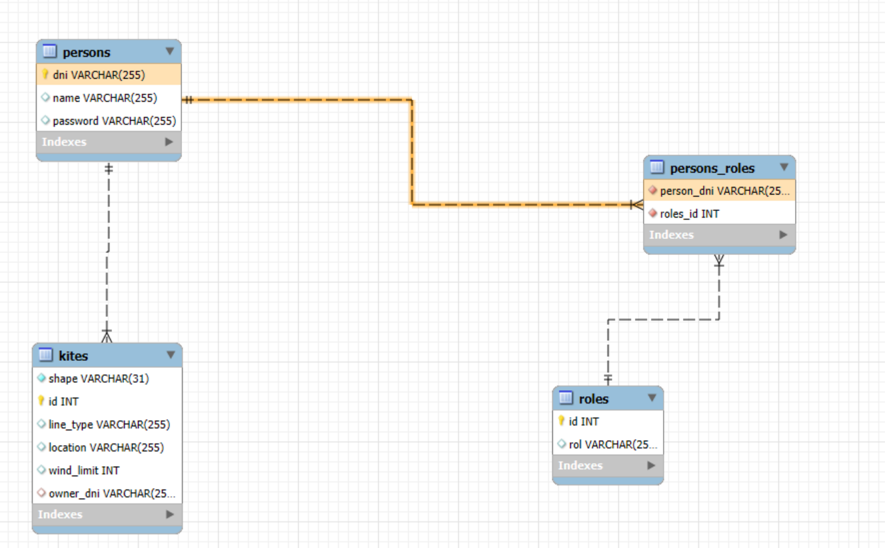
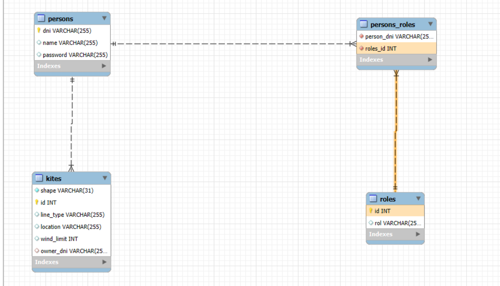

# Descripción del proyecto

## Este proyecto consiste en la gestión de una base de datos que consta de cometas y personas.

### Mi tablero de Trello https://trello.com/b/YTSiRLbZ/kite-project

1. Aquí tengo definido el UML y sus relaciones correspondientes 

https://www.plantuml.com/plantuml/uml/SoWkIImgAStDuNBAJrBGjLDmpCbCJbMmKiX8pSd9vt98pKi1IW80

```
@startuml
abstract class Kite{
- id: int
- windLimit: int
- shape: KiteShape
- line: LineType
- location: String
- owner: Person
  }

class StuntKite extends Kite {

}

class StaticKite extends Kite {
}

class TractionKite extends Kite {
}

class Person {
- dni: String
- name: String
- kites: Kite[]
- role: Role
- password: String
  }

enum KiteShape {
DELTA, DIAMOND, PARAFOIL
}

enum LineType {
SINGLE_LINE, DUAL_LINE
}

enum ERole {
ADMIN, USER
}

class Role {
- id: int
- rol: ERole
}

Kite "*" o-- "1" Person

@enduml
```



2. Así es como he creado el proyecto, con estás dependencias



3. Una vez levantado el servidor, me crea las tablas automáticamente, ya que en el fichero properties, tengo configurado esta opción

```spring.jpa.hibernate.ddl-auto=update```

Estás son las tablas resultantes, cuyas relaciones son estas, como se puede observar, el shape de la tabla kites es una columna
determinante, también llamada como discriminator value, ya que esta va a determinar el tipo de cometa que tiene la persona:








