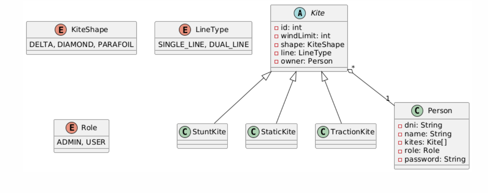

# Descripción del proyecto

## Este proyecto consiste en la gestión de una base de datos que consta de cometas y personas.

1. Aquí tengo definido el UML y sus relaciones correspondientes 

https://www.plantuml.com/plantuml/uml/SoWkIImgAStDuNBAJrBGjLDmpCbCJbMmKiX8pSd9vt98pKi1IW80

```
@startuml
abstract class Kite{
- id: int
- windLimit: int
- shape: KiteShape
- line: LineType
- owner: Person
  }

class StuntKite extends Kite {

}

class StaticKite extends Kite {
}

class TractionKite extends Kite {
}

class Person {
- dni: String
- name: String
- kites: Kite[]
- role: Role
- password: String
  }

enum KiteShape {
DELTA, DIAMOND, PARAFOIL
}

enum LineType {
SINGLE_LINE, DUAL_LINE
}

enum Role {
ADMIN, USER
}

Kite "*" o-- "1" Person

@enduml
```


