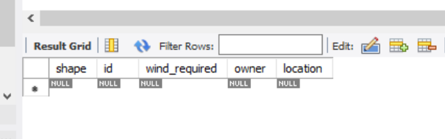

# Descripción del proyecto

## Este proyecto consiste en la gestión de una base de datos que consta de cometas y personas.

### Mi tablero de Trello https://trello.com/b/YTSiRLbZ/kite-project

### Presentación con slides 
https://www.canva.com/design/DAGnVvLkai8/cfejTn0jg6HY0nOd8G5iuQ/edit?utm_content=DAGnVvLkai8&utm_campaign=designshare&utm_medium=link2&utm_source=sharebutton

1. Aquí tengo definido el UML y sus relaciones correspondientes 

```
@startuml
abstract class Kite{
- id: int
- windRequired: int
- shape: KiteShape
- location: String
- owner: Person
  }

class StuntKite extends Kite {

}

class StaticKite extends Kite {
}

class TractionKite extends Kite {
}

class Person {
- userName: String
- password: String
- kites: Kite[]
- roles: Role[]
  }

enum KiteShape {
DELTA, DIAMOND, PARAFOIL
}

enum ERole {
ADMIN, USER
}

class Role {
- id: int
- rol: ERole
}

Kite "*" o-- "1" Person

Role "*" o-- "*" Person
@enduml
```


2. Así es como he creado el proyecto, con estás dependencias


3. Una vez levantado el servidor, me crea las tablas automáticamente, ya que en el fichero properties, tengo configurado esta opción

```spring.jpa.hibernate.ddl-auto=update```

Estás son las tablas resultantes, cuyas relaciones son estas, como se puede observar, el shape de la tabla kites es una columna
determinante, también llamada como discriminator value, ya que esta va a determinar el tipo de cometa que tiene la persona:


Como se puede observar en las imágenes, en la tabla kite, hay una columna especial llamada shape, ya que en Java, al haber una clase
madre (Kite) y varias clases hijas, que hacen referencia a los distintos tipos de cometas. Como aplicamos herencia, he escogido la estrategia
de una unica tabla con una columna discriminatoria.

4. Para que funcione la autenticación, he añadido esta dependencia en el fichero pom.xml

```
<dependency>
	<groupId>com.auth0</groupId>
	<artifactId>java-jwt</artifactId>
	<version>3.18.1</version>
</dependency>
```

5. Demos con postman

Inicialmente, tenemos las tablas así

* Persons


* Kites (he vaciado esta tabla para documentar las demos de los insert)


* Roles (inserto los datos manualmente en MySQL)


* Persons_roles (inserto los datos manualmente en MySQL)


  
#### Inserciones
  
  Las inserciones requieren el token de un administrador, de no tener el token de administrador, no va a ejecutar la petición

  - Nuevas cometas
    
   Por ejemplo, le asigno a hombre_de_la_rae
   
   
   
   
   
   

   Ahora voy a asignarle 2 cometas a auronplay
   
   

   
   
   La tabla resultante de kites que nos queda es esta
   
   

  - Nuevas personas
    
    Para crear nuevas personas, requiere que el que lo realice tenga como rol un administrador, para ello, he creado mediante un test
    un administrador para que me encripte la contraseña del admin. 
     
    
  
   Recordemos que los roles son estos.
   
   
   
   Y la tabla que gestiona los roles es ésta
   

   Cada vez que añada una nueva persona, dependiendo del rol, hay que hacer manualmente en MySQL este insert, el rol_id hace referencia al
   número que tiene el id del rol en la tabla de roles.
     ```
     insert into persons_roles (person_username, roles_id) values (<'userName'>, <rol_id>);
     ```

 Aquí estoy insertando a una nueva persona, le he pasado el token de un administrador
  
 
 
 Si inserto otra persona, pero sin pasarle el token no me va a dejar, tampoco me va a dejar si le paso el token cuyo rol no es ADMIN
 

#### Muestreo

* Muestreo de personas
  
  Al mostrar personas, muestra tanto los roles como las cometas que tiene dicha persona
  
  - Muestro todas las personas
     
     
  
  - Muestro una persona por username
     
    


* Muestreo de cometas
   
   - Muestro todas las cometas
      
     
  
   - Muestro las cometas registradas en Madrid
     
      
  
   - Muestro las cometas que pertenecen a hombre_de_la_rae
      
      
  
   - Muestro las cometas que pertenecen a hombre_de_la_rae y que estén registradas en Madrid
     
     
  
   - Muestro una cometa por id
      
     

    
#### Modificaciones

En una API Rest, hay 2 formas de hacer modificaciones:

- PUT: Para realizar modificaciones completas, por lo tanto, requiere que el usuario especifique todos los campos, lo que viene a ser
  un remplazo. Aunque haya campos que se desse mantener los valores, hay que especificarlos también con esos mismos valores.

- PATCH: Para realizar modificaciones parciales, aquí se garantiza que se puedan modificar ciertas caracteristicas sin especificar
  todos los campos.

En cuando a modificaciones  parciales, se puede modificar o bien el viento requerido
o bien la ubicación donde se use, garantizando que esa modificación solo la pueda realizar el dueño.

Así como las modificaciones totales, que también requiere que el que lo realice sea el dueño

  - Le modifico la ubicación a una cometa de auronplay
    
    
   
    Así queda la tabla
   
    


  - Ahora, le modifico el viento requerido
    
    

    Así queda la tabla
    
    
 
   - Ahora, pruebo a hacer un remplazo total. 
     
     

     Así quedaría la tabla
     
     


#### Eliminaciones

 Partimos de las tablas así, por un lado, tenemos la tabla con las cometas. Estos endpoints requiere que lo realice un admin.
 
  

 Y por otro lado, tenemos la tabla con las personas
  
  
  
  * Eliminación de cometas

 Vamos a eliminar las 2 cometas que tiene auronplay, 
  
   
   
   

 La tabla quedaría así
  
  

  * Eliminación de personas
    
    Inicialmente, la tabla personas están así
     
     
   
    Voy a probar a eliminar a auronplay
    
     

    Finalmente, la tabla de personas quedaría así
     
    


   
   


 
