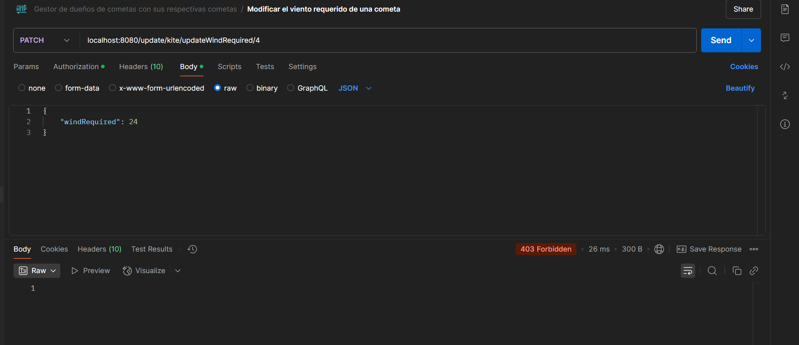

# Descripción del proyecto

## Este proyecto consiste en la gestión de una base de datos que consta de cometas y personas.

### Mi tablero de Trello https://trello.com/b/YTSiRLbZ/kite-project

1. Aquí tengo definido el UML y sus relaciones correspondientes 

```
@startuml
abstract class Kite{
- id: int
- windLimit: int
- shape: KiteShape
- line: LineType
- location: String
- owner: Person
  }

class StuntKite extends Kite {

}

class StaticKite extends Kite {
}

class TractionKite extends Kite {
}

class Person {
- userName: String
- password: String
- kites: Kite[]
- roles: Role[]
  }

enum KiteShape {
DELTA, DIAMOND, PARAFOIL
}

enum LineType {
SINGLE_LINE, DUAL_LINE
}

enum ERole {
ADMIN, USER
}

class Role {
- id: int
- rol: ERole
}

Kite "*" o-- "1" Person

Role "*" o-- "*" Person
@enduml
```


2. Así es como he creado el proyecto, con estás dependencias


3. Una vez levantado el servidor, me crea las tablas automáticamente, ya que en el fichero properties, tengo configurado esta opción

```spring.jpa.hibernate.ddl-auto=update```

Estás son las tablas resultantes, cuyas relaciones son estas, como se puede observar, el shape de la tabla kites es una columna
determinante, también llamada como discriminator value, ya que esta va a determinar el tipo de cometa que tiene la persona:


Como se puede observar en las imágenes, en la tabla kite, hay una columna especial llamada shape, ya que en Java, al haber una clase
madre (Kite) y varias clases hijas, que hacen referencia a los distintos tipos de cometas. Como aplicamos herencia, he escogido la estrategia
de una unica tabla con una columna discriminatoria.

4. Para que funcione la autenticación, he añadido esta dependencia en el fichero pom.xml

```
<dependency>
	<groupId>com.auth0</groupId>
	<artifactId>java-jwt</artifactId>
	<version>3.18.1</version>
</dependency>
```

5. Demos con postman

Actualmente, tras realizar varios test, tengo registros en las tablas persons y kites.

* Muestreo personas

Por un lado, en las tablas person tenemos esto:


Al mostrar las personas, nos lo muestra con sus cometas y sus roles


Lo mismo pasa cuando muestro una persona en particular


* Muestreo cometas

Por otro lado, en las tablas kites tenemos esto:


Por otro lado, al mostrar todas las cometas, simplemente muestro las cometas que hay en la base de datos.
Ya que de mostrar también a sus dueños, entrariamos en una redundancia ciclica y la salida se haría ilegible.


Ese mismo endpoint permite incluir parámetros para realizar búsquedas filtradas. 

 - Búsqueda por dueño
    
    

 - Búsqueda por ubicación donde se usan

    

 - Búsqueda por ambos filtros, tanto dueño como ubicación
    
    

Al obtener una cometa por id, me sale este resultado


* Modificaciones

En una API Rest, hay 2 formas de hacer modificaciones:

 - PUT: Para realizar modificaciones completas, por lo tanto, requiere que el usuario especifique todos los campos, lo que viene a ser
   un remplazo. Aunque haya campos que se desse mantener los valores, hay que especificarlos también con esos mismos valores.

 - PATCH: Para realizar modificaciones parciales, aquí se garantiza que se puedan modificar ciertas caracteristicas sin especificar 
   todos los campos.

Las modificaciones de cometas que he implementado de momento han sido parciales, de forma que se pueda modificar o bien el viento requerido
o bien la ubicación donde se use, garantizando que esa modificación solo la pueda realizar el dueño.

Ahora, hombre_de_la_rae va a intentar modificar el viento requerido y la ubicación del auronplay




La tabla permanece igual


Como se puede observar, no lo permite, ahora voy a hacer lo mismo, pero con el token del dueño correspondiente


Y si visualizamos de nuevo la tabla, ya está con los datos actualizados


