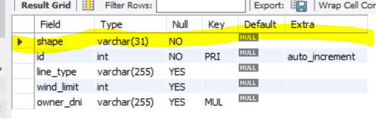

# Descripción del proyecto

## Este proyecto consiste en la gestión de una base de datos que consta de cometas y personas.

1. Aquí tengo definido el UML y sus relaciones correspondientes 

https://www.plantuml.com/plantuml/uml/SoWkIImgAStDuNBAJrBGjLDmpCbCJbMmKiX8pSd9vt98pKi1IW80

```
@startuml
abstract class Kite{
- id: int
- windLimit: int
- shape: KiteShape
- line: LineType
- owner: Person
  }

class StuntKite extends Kite {

}

class StaticKite extends Kite {
}

class TractionKite extends Kite {
}

class Person {
- dni: String
- name: String
- kites: Kite[]
- role: Role
- password: String
  }

enum KiteShape {
DELTA, DIAMOND, PARAFOIL
}

enum LineType {
SINGLE_LINE, DUAL_LINE
}

enum Role {
ADMIN, USER
}

Kite "*" o-- "1" Person

@enduml
```


2. Así es como he creado el proyecto, con estás dependencias


3. Una vez levantado el servidor, me crea las tablas automáticamente, ya que en el fichero properties, tengo configurado esta opción

```spring.jpa.hibernate.ddl-auto=update```

Estás son las tablas resultantes:

 * Por un lado, tenemos la tabla que hace referencia a las cometas, lo que está resaltado en amarillo hace referencia a la columna
   determinante, es decir, la que nos va a indicar el tipo de cometa

     

    
 * Por otro lado, tenemos la tabla que hace referencia a las personas

     

Posteriormente, he de crear manualmente una tercera tabla que haga referencia a los roles.


